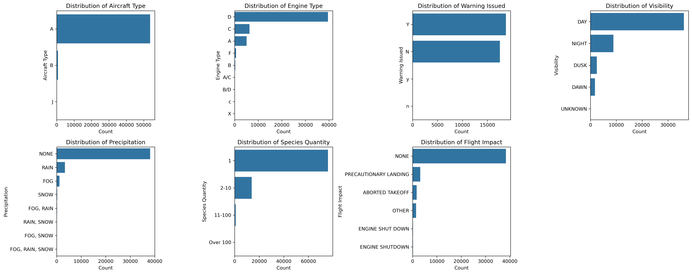
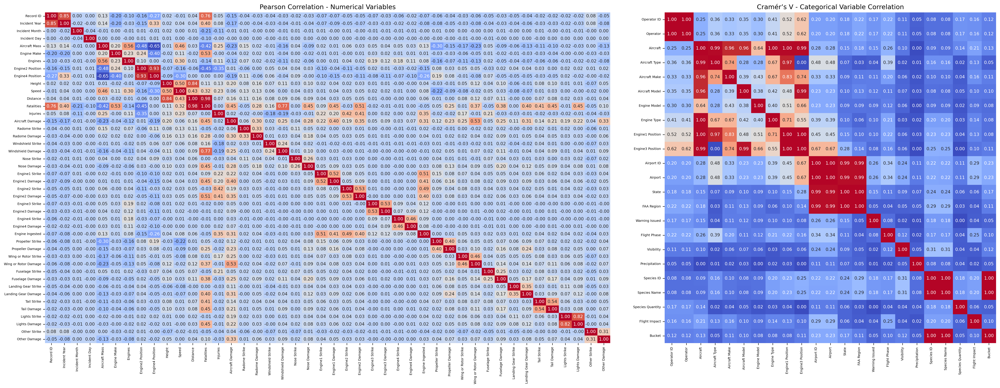
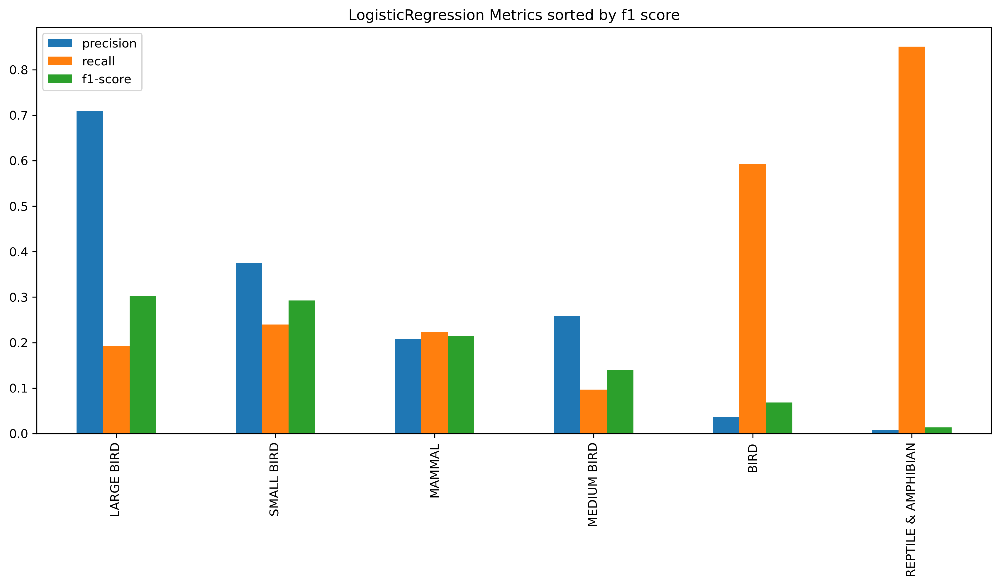
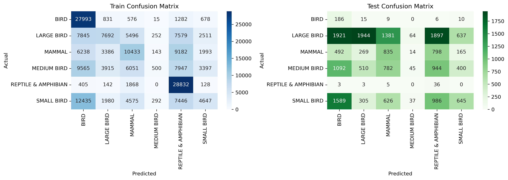

# Introduction

Aircraft wildlife strikes are a major safety concern in aviation. This project predicts the most likely animal species involved in a strike based on factors like flight phase, location, and altitude.

# Dataset used.

Here is a detailed description of the features in thedataset https://wildlife.faa.gov/assets/fieldlist.pdf

Based on the provided dataset, here's the expected data type for each of the columns:

1. **Record ID**: `Integer` Individual record number
2. **Incident Year**: `Integer` Year strike occurred
3. **Incident Month**: `Integer` Month strike occurred
4. **Incident Day**: `Integer` Date strike occurred
5. **Operator ID**: `String` Airline operator code
6. **Operator**: `String` Civil Aviation Organization Name
7. **Aircraft**: `String` Aircraft
8. **Aircraft Type**: `String` Type of aircraft
9. **Aircraft Make**: `String` International Civil Aviation Organization code for Aircraft Make
10. **Aircraft Model**: `String` International Civil Aviation Organization code for Aircraft Model
11. **Aircraft Mass**: `Integer` 1 = 2,250 kg or less: 2 = ,2251-5700 kg: 3 = 5,701-27,000 kg: 4 = 27,001-272,000 kg: 5 = above 272,000 kg
12. **Engine Make**: `String` Engine Make Code
13. **Engine Model**: `String` Engine Model Code
14. **Engines**: `Integer` Number of engines
15. **Engine Type**: `String` Type of power A = reciprocating engine (piston): B = Turbojet: C = Turboprop: D = Turbofan: E = None (glider): F = Turboshaft (helicopter): Y = Other
16. **Engine1 Position**: `String` Where engine # 1 is mounted on aircraft
17. **Engine2 Position**: `String` Where engine # 2 is mounted on aircraft
18. **Engine3 Position**: `String` Where engine # 3 is mounted on aircraft
19. **Engine4 Position**: `String` Where engine # 4 is mounted on aircraft
20. **Airport ID**: `String` International Civil Aviation Organization airport identifier for location of strike whether it was on or off airport
21. **Airport**: `String` Name of airport
22. **State**: `String` State
23. **FAA Region**: `String` FAA Region where airport is located
24. **Warning Issued**: `String` Pilot warned of birds/wildlife
25. **Flight Phase**: `String` Phase of flight during which strike occurred
26. **Visibility**: `String` Type of cloud cover, if any
27. **Precipitation**: `String` Precipitation
28. **Height**: `Integer` Feet Above Ground Level
29. **Speed**: `Float` Knots (indicated air speed)
30. **Distance**: `Float` Nautical miles from airport
31. **Species ID**: `String` International Civil Aviation Organization code for type of bird or other wildlife
32. **Species Name**: `String` Common name for bird or other wildlife
33. **Species Quantity**: `Integer`
34. **Flight Impact**: `String` Impact on the flight
35. **Fatalities**: `Integer` Number of human fatalities
36. **Injuries**: `Integer` Number of people injured
37. **Aircraft Damage**: `Integer`
38. **Radome Strike**: `Integer`
39. **Radome Damage**: `Integer`
40. **Windshield Strike**: `Integer`
41. **Windshield Damage**: `Integer`
42. **Nose Strike**: `Integer`
43. **Nose Damage**: `Integer`
44. **Engine1 Strike**: `Integer`
45. **Engine1 Damage**: `Integer`
46. **Engine2 Strike**: `Integer`
47. **Engine2 Damage**: `Integer`
48. **Engine3 Strike**: `Integer`
49. **Engine3 Damage**: `Integer`
50. **Engine4 Strike**: `Integer`
51. **Engine4 Damage**: `Integer`
52. **Engine Ingested**: `Integer`
53. **Propeller Strike**: `Integer`
54. **Propeller Damage**: `Integer`
55. **Wing or Rotor Strike**: `Integer`
56. **Wing or Rotor Damage**: `Integer`
57. **Fuselage Strike**: `Integer`
58. **Fuselage Damage**: `Integer`
59. **Landing Gear Strike**: `Integer`
60. **Landing Gear Damage**: `Integer`
61. **Tail Strike**: `Integer`
62. **Tail Damage**: `Integer`
63. **Lights Strike**: `Integer`
64. **Lights Damage**: `Integer`
65. **Other Strike**: `Integer`
66. **Other Damage**: `Integer`

# Sample values for the categorical features

1. **Operator ID** [DAL, HAL, UNK, MIL, USA, BUS, SWA, PVT, UPS, ...]
2. **Operator** [DELTA AIR LINES, HAWAIIAN AIR, UNKNOWN, MILIT...]
3. **Aircraft** [B-757-200, DC-9, UNKNOWN, F-16, B-737-200, HA...]
4. **Aircraft Type** [A, nan, B, J]
5. **Aircraft Make** [148, 583, nan, 561, 443, 729, 395, 123, 70, 3...]
6. **Aircraft Model** [26, 90, nan, 13, 30, 24, 23, 14, 20, 3, 8, 2,...]
7. **Engine Model** [40, 10, nan, 1, 19, 37, 7, 4, 3, 34, 52, 31, ...]
8. **Engine Type** [D, nan, B, A, C, F, B/D, A/C, c, X]
9. **Engine1 Position** [1, 5, nan, 7, 4, 6, 2, 3, C]
10. **Engine3 Position** [nan, 1, 5, 4, CHANGE CODE, 3]
11. **Airport ID** [KCVG, PHLI, KJAX, KMCO, KJWN, KFSM, KMSY, KIK...]
12. **Airport** [CINCINNATI/NORTHERN KENTUCKY INTL ARPT, LIHUE...]
13. **State** [KY, HI, FL, TN, AR, LA, MI, NJ, MN, nan, NY, ...]
14. **FAA Region** [ASO, AWP, ASW, AGL, AEA, nan, ACE, FGN, ANM, ...]
15. **Warning Issued** [nan, N, Y, n, y]
16. **Flight Phase** [CLIMB, TAKEOFF RUN, nan, LANDING ROLL, APPROA...]
17. **Visibility** [nan, DAY, NIGHT, DUSK, DAWN, UNKNOWN]
18. **Precipitation** [nan, NONE, FOG, RAIN, SNOW, FOG, RAIN, FOG, S...]
19. **Species Quantity** [1, 2-10, nan, 11-100, Over 100]
20. **Flight Impact** [nan, PRECAUTIONARY LANDING, OTHER, ABORTED TA...]
21. **Bucket** [LARGE BIRD, SMALL BIRD, MEDIUM BIRD, MAMMAL, ...]

# What are you planning to predict. How might this prediction be used in production or in practice?

I want to predict the type of species that will be injured based on the flight phase, the distance from airport, the state, the Visibility and others. This prediction can help Aviation build a system to block these animals based on the phases. Some airports Already use Bird Deterrent Systems like Predator calls (e.g., hawk or falcon cries), Distress calls of the birds themselves, Pyrotechnic sounds (like loud bangs). But they dont do much in mid flight because most birds dont flight in high altitude but on the take off and such they usually encounter birds and other animal.

# APPROACH 1 Using Bucketing / Higher category Eden

### Process overview

At first I had select the columns by the intuition rather than the correlation and without bucketing. Then I played around with the dataset and added engineered feature(Bucketing the species to higher category) and I had to redo everything after that. I did correlation using cramer and correlation matrix for categorical and numeric. I then removed correlated vairables. Then I splited then did the imputation and the encoding, SMOTE and did PCA.

Then I used this dataset to create the models. I also faced huge issue when training the model because the data set is very huge and hyper-parameter tuning using grid search was very hard.

# EDA

### X and Y variables

Y variable is the newly engineered feature Bucketed species or higher categroy for the species. The column name is Bucket
X are the rest of the columns above.

### How many observations?

I have 174104 samples which was reduced by doing preprocessing. I didnt have any Null species but I had 80771 species with UNK as their ID in other words these animals aren't identified hence are removed. 80771. Afterward I did SMOTE since the dataset is very imbalanced.

Before SMOTE but after clean up and train/test split it was (74602, 1072) and after SMOTE it is (188250, 1072). So I have 6 species each with 31375 entries in them.

### New feature engineered

Due to the amount of spicies typw a new feature was created by categorizing the species into a bigger umbrella. The created category/bucket are as follows:

    'SMALL BIRD': [
        'SPARROW', 'FINCH', 'WARBLER', 'WREN', 'VIREO', 'CHICKADEE', 'TITMOUSE','BUDGERIGAR',
        'SWIFT', 'HUMMINGBIRD', 'NUTHATCH', 'WAXWING', 'JUNCO', 'BUNTING',
        'KINGLET', 'BUSHTIT', 'PIPIT', 'VERDIN', 'GNATCATCHER', 'TOWHEE',
        'PHOEBE', 'VIREOS', 'MYNA', 'BULBUL',  'PINE SISKIN',
        'LONGSPUR', 'CHAT', 'UNKNOWN SMALL BIRD',  'MUNIA', 'SWALLOW',
        'WAXBILL', 'TANAGER','CANARY', 'DRONGO', 'WHITE-EYE', 'ELAENIA',
        'HORNED LARK', 'ROSE-BREASTED GROSBEAK', 'NORTHERN PARULA', 'AMERICAN REDSTART',
        'VEERY', 'EURASIAN SKYLARK', 'BOBOLINK', 'DICKCISSEL', 'RED AVADAVAT',
        'CHUCK-WILL\'S-WIDOW', 'LARKS', 'RED-NAPED SAPSUCKER', 'DOWNY WOODPECKER',
        'HAIRY WOODPECKER', 'RED-BREASTED SAPSUCKER', 'COMMON YELLOWTHROAT',
        'WHITE-WINGED CROSSBILL', 'PINE GROSBEAK', 'EVENING GROSBEAK',
        'BLACK-HEADED GROSBEAK', 'BLUE GROSBEAK', 'RED CROSSBILL', 'REDWING',
        'COMMON REDPOLL', 'HOARY REDPOLL', 'ROADRUNNER'
    ],
    'MEDIUM BIRD':[
        'UNKNOWN MEDIUM BIRD','DOVE', 'CUCKOO', 'SHRIKE', 'KINGBIRD', 'MOCKINGBIRD','RED-LEGGED PARTRIDGE',
        'THRASHER', 'JAY', 'MARTIN', 'ROBIN', 'THRUSH', 'CARDINAL', 'COWBIRD', 'ORIOLE', 'CROW', 'RAVEN', 'JAY', 'MAGPIE', 'STARLING', 'ROOK', 'GRACKLE',
        'BLACKBIRD', 'BOAT-TAILED', 'RED-WINGED','WHIP-POOR-WILL', 'BELTED KINGFISHER', 'YELLOW-BELLIED SAPSUCKER',
        'RED-BELLIED WOODPECKER', 'WOODPECKERS, PICULETS', 'WOODPECKERS',
        'RED-HEADED WOODPECKER', 'MONK PARAKEET', 'NANDAY PARAKEET',
        'OLIVE-THROATED PARAKEET', 'PARROTS', 'GREAT KISKADEE', 'SCALED QUAIL',
        'CHUKAR', 'QUAILS', 'EURASIAN THICK-KNEE', 'DOUBLE-STRIPED THICK-KNEE',
        'COMMON PAURAQUE', 'GREATER ROADRUNNER'
    ],
    'LARGE BIRD': [
        'GOOSE', 'GEESE', 'DUCK', 'HERON', 'EGRET', 'CORMORANT', 'PELICAN', 'NORTHERN FULMAR',
        'CRANE', 'SWAN', 'TURKEY', 'IBIS', 'LOON', 'RAIL', 'GALLINULE',
        'BITTERN', 'PHALAROPE', 'MOORHEN', 'AVOCET', 'GODWIT', 'CURLEW',
        'SPOONBILL', 'JAEGER', 'SHEARWATER', 'ALBATROSS', 'STORK', 'PETREL',
         'PHEASANT', 'GROUSE', 'GUINEAFOWL', 'FRANCOLIN', 'PTARMIGAN','UNKNOWN LARGE BIRD'
        'PARTRIDGE', 'TURKEY','DOWITCHER', 'DUNLIN',
        'SKIMMER', 'TROPICBIRD', 'NODDY', 'FRIGATEBIRD',
        'SHOREBIRD','SANDPIPER', 'PLOVER', 'STILT', 'OYSTERCATCHER',
        'PHALAROPE', 'TERN', 'GULL', 'SKUA', 'KITTIWAKE',
        'MURRE', 'GUILLEMOT', 'PUFFIN', 'ALBATROSS', 'SHEARWATER',
        'PETREL', 'GREBE', 'COOT', 'RAIL', 'GALLINULE', 'WATERTHRUSH',
        'YELLOWLEGS', 'SORA', 'MERGANSER', 'TEAL', 'DUCK', 'WIGEON',
        'SHOVELER', 'EIDER', 'SNIPE', 'TURNSTONE', 'AVOCET', 'MOORHEN',
        'WOODCOCK', 'SCOTER', 'GADWALL', 'PINTAIL',
        'EAGLE', 'FALCON', 'OSPREY', 'VULTURE', 'CARACARA', 'KITE',
        'MERLIN', 'KESTREL', 'BUZZARD', 'OWL', 'EAGLE', 'HAWK',  'HARRIER', 'OSPREY', 'CARACARA',
        'KITE', 'SCREECH', 'NIGHTJAR', 'NIGHTHAWK', 'POORWILL', 'SAW-WHET','MALLARD', 'ANHINGA', 'NORTHERN FLICKER', 'BRANT', 'NORTHERN LAPWING',
        'GRAY PARTRIDGE', 'NORTHERN BOBWHITE', 'LESSER SCAUP', 'CANVASBACK',
        'WHIMBREL', 'GREATER SCAUP', 'WILLET', 'SANDERLING', 'BUFFLEHEAD',
        'REDHEAD', 'COMMON GOLDENEYE', 'BARROW\'S GOLDENEYE', 'RED-FOOTED BOOBY',
        'RED KNOT', 'SOUTHERN LAPWING', 'YELLOW-HEADED CARCARA'
    ],
    'BIRD':['UNKNOWN BIRD OR BAT','BIRD', 'UNKNOWN BIRD'],
    'MAMMAL':['UNKNOWN TERRESTRIAL MAMMAL',
        'DEER', 'MOOSE', 'ELK', 'HORSE', 'COW', 'PIG', 'SWINE', 'BURRO',
        'PRONGHORN', 'BISON', 'ANTELOPE','CARIBOU',  'PECCARY',
         'HARE', 'SKUNK', 'RACCOON', 'OPOSSUM', 'WOODCHUCK', 'BAT',
        'SQUIRREL', 'MARMOT', 'MUSKRAT', 'BEAVER', 'ARMADILLO', 'RODENT',
        'MINK', 'WEASEL', 'FERRET','RAT','SHREW', 'MOUSE',  'VOLE', 'CHIPMUNK',
        'PORCUPINE', 'RABBIT', 'COTTONTAIL',
        'FOX', 'COYOTE', 'WOLF', 'DOG', 'CAT', 'BOBCAT', 'LYNX', 'BEAR',
        'CANID', 'FELINE', 'RINGTAIL', 'JACKAL', 'MOUNTAIN LION', 'COATI', 'OTTER','BADGER', 'YUMA MYOTIS', 'LONG-EARED MYOTIS', 'COMMON PIPISTRELLE','MYOTIS',
        'LONG-LEGGED MYOTIS'
    ],
    'REPTILE & AMPHIBIAN': [
        'TURTLE', 'SNAKE', 'LIZARD', 'ALLIGATOR', 'CROCODILE', 'FROG',
        'TOAD', 'IGUANA', 'TERRAPIN', 'GECKO', 'TORTOISE',  'COOTER','SLIDER', 'MOCCASIN'
    ],
    'UNKNOWN / OTHER': [
        'UNKNOWN',
         'OTHER', 'UNIDENTIFIED','NAN'
    ]

### What is the distribution of each feature?

To balance I did SMOTE. Before SMOTE it was (74602, 1072) and after SMOTE it is (188250, 1072).
So I have 6 category/bucket each with 31375 entries in them.

### Correlation 

To see the corelation of the features I have used cramers for categorical and correlation matrix for the numeric features. There was some corelation and due to that I have removed the features listed below.

['Speed', 'Aircraft Make','Operator','Engine3 Damage','Incident Year','Engine2 Damage','Lights Damage', 'Engine1 Damage', 'State', 'Wing or Rotor Damage','Engines', 'Engine Ingested','Engine Model','Distance','Engine1 Position','Airport','Engine4 Position','Tail Damage','Fatalities', 'Aircraft Type','FAA Region', 'Species Name','Engine Type','Aircraft Model','Windshield Damage', 'Engine3 Position','Airport ID','Species ID'] are highly correlated.

### Encoding

I used one hot encoding becuase none of the categorical variable had any ordinal information hence I didnt want the data set to have such kind of order hence why I used One hot encoding.

# Model fitting

### Train / test splitting

The training consists 80% of the data and is startified by the Y(The bucketed feature)

### Models

I have tried Logistic, Random forest(Before and after PCA), SVC, Random forest, neural network.
The reason that these models were choose was because first they all work for classification mode. 

Due to the amount of the entries and the limit of resources I were only able to implement the grid search just for the SVC with only 5% of the dataset. For other models I set the own values for the hyper-parameters.

# Validation / metrics

Since the model is a classfication I are using classfication metrics. I used f1 score for each class and the weighted accuracy because the bucket had a very imbalanced data.

### Confusion matrix and confusion discussion for classification problems. Results, weakness for each model

Logistics

Random Forest (Before PCA)

SVC

Random Forest (After doing PCA)

Neural network

| Model                        | Accuracy Train | Accuracy Test | Is it Overfitting | Chosen because                                                                |
| ---------------------------- | -------------- | ------------- | ----------------- | ----------------------------------------------------------------------------- |
| Logistic Regression          | 0.4019         | 0.1945        | Yes               | Simple model                                                                  |
| SVC (sampled hyperparameter) | 0.6047         | 0.3176        | Yes               | Used for classification                                                       |
| Random Forest (Before PCA)   | 0.9999         | 0.4352        | Yes               | Handles overfitting better than decision tree                                 |
| Random Forest (After PCA)    | 0.5593         | 0.3093        | Yes               | Handles overfitting better than decision tree                                 |
| Neural Network               | 0.4700         | 0.2654        | Yes               | Works well with large datasets, can help handle overfitting even after tuning |

### 2-4 prediction examples from the data.

You can also run the predict.py which will run the interface for you to make the prediction. It uses the dumped model to process the new data taken from users and make the prediction.
Entry 1:
Features: [-2.18386017e-01 -1.15562177e+00 1.88259434e+00 -9.82996343e-01
-3.80847915e-01 2.31224490e+00 1.56084194e-01 -9.72281857e-01
3.67896220e-01 8.41555979e-01 8.86937838e-01 9.68423379e-01
6.04370502e-01 7.38752614e-02 -1.08846276e+00 1.77247828e-01
1.12571837e-01 9.84870552e-02 2.23528357e-01 5.04971558e-01
3.74179925e-01 -1.24378350e-01 -1.49606757e+00 -4.41766524e-01
-1.30388614e-02 -8.92840850e-02 -1.43128794e-02 -4.10804859e-04
1.35232854e-01 2.51531172e-01 3.15616782e-01 -3.44558694e-01
-4.20605619e-01]
True label: LARGE BIRD
Predicted label: BIRD

Entry 2:
Features: [ 0.29797952 -2.18935326 0.41443709 0.4226905 -0.30745103 -0.63309687
-0.97563742 -0.88408244 2.44932042 0.82940199 0.6435669 -1.07451688
1.21848417 1.51621966 1.04473795 -0.36527713 -0.09932526 -0.06207072
0.42372094 0.2175484 -0.34869938 0.4143166 0.70893291 -0.92982956
0.17745947 0.39043041 0.03931645 0.06374542 -0.46927282 -0.10661812
-0.81991585 0.42317526 -0.11675918]
True label: MAMMAL
Predicted label: BIRD

Entry 3:
Features: [-0.88725165 0.69554031 -0.26980949 -0.06102212 -0.17382483 -0.19047202
0.14371195 -0.14881757 -0.09649245 0.43699426 0.28106644 -0.08386915
0.04226312 0.29718649 0.35167427 -0.3759099 0.29418043 -0.12036991
-0.4917704 -0.04424618 -0.0165084 -0.11330286 0.11066951 0.00187721
-0.00490358 0.04275581 0.03563314 -0.01701597 0.0822881 -0.02950286
0.12415665 0.16888351 0.0372535 ]
True label: MAMMAL
Predicted label: MAMMAL

Entry 4:
Features: [-1.0720253 0.56011116 0.40913255 -0.22244218 -0.04076989 -0.39222482
0.44204437 -0.1049835 -0.1035525 0.24566086 0.35345546 -0.27821836
-0.09287035 0.139383 0.29356931 -0.02175394 -0.01448588 -0.02637339
-0.1781599 -0.06461874 -0.04687454 0.02225565 0.13639208 0.01605285
0.00713831 0.03397384 0.01230328 -0.02863969 0.02656799 0.01028598
0.05118453 0.08419041 -0.00950448]
True label: LARGE BIRD
Predicted label: REPTILE & AMPHIBIAN

### 2 prediction examples which are new or synthesized.

#### Synthesized Sample 1:

Record ID 200001
Incident Month 3
Incident Day 15
Operator ID UAL
Aircraft A320
Aircraft Mass 3.5
Engine Make 12.0
Engine2 Position 1.0
Warning Issued YES
Flight Phase APPROACH
Visibility CLEAR
Precipitation NONE
Height 1200
Species Quantity MEDIUM
Flight Impact PRECAUTIONARY LANDING
Injuries 0
Aircraft Damage 1
Radome Strike 0
Radome Damage 0
Windshield Strike 0
Nose Strike 1
Nose Damage 1
Engine1 Strike 1
Engine2 Strike 0
Engine3 Strike 0
Engine4 Strike 0
Engine4 Damage 0
Propeller Strike 0
Propeller Damage 0
Wing or Rotor Strike 0
Fuselage Strike 0
Fuselage Damage 0
Landing Gear Strike 0
Landing Gear Damage 0
Tail Strike 0
Lights Strike 0
Other Strike 0
Other Damage 0
Name: 0, dtype: object
Predicted Label: LARGE BIRD

#### Synthesized Sample 2:

Record ID 200002
Incident Month 6
Incident Day 30
Operator ID AAL
Aircraft B737
Aircraft Mass 4.0
Engine Make 22.0
Engine2 Position 2.0
Warning Issued NO
Flight Phase TAKEOFF RUN
Visibility FOG
Precipitation RAIN
Height 300
Species Quantity HIGH
Flight Impact NONE
Injuries 0
Aircraft Damage 0
Radome Strike 0
Radome Damage 0
Windshield Strike 1
Nose Strike 0
Nose Damage 0
Engine1 Strike 0
Engine2 Strike 0
Engine3 Strike 0
Engine4 Strike 0
Engine4 Damage 0
Propeller Strike 0
Propeller Damage 0
Wing or Rotor Strike 1
Fuselage Strike 1
Fuselage Damage 1
Landing Gear Strike 0
Landing Gear Damage 0
Tail Strike 0
Lights Strike 1
Other Strike 0
Other Damage 0
Name: 1, dtype: object
Predicted Label: LARGE BIRD

### Applying techniques to mitigate underfitting/overfitting

The random forest was overfitting before I add PCA. I wanted 95% of the variance and that is how I calculated the PCA and redid the random forest but it is still overfitting.

Applied technique for Random forest was adding parameters such as , max_depth=5, min_samples_split=10, min_samples_leaf=20.
Applied technique for SVC was using 5% of the sample to find the hyperparameters.
For neural eventhough dropout, decreasing the density and l2 regularization and early stopping was used it is still overfitting slightly.

# Production

### Deployment of use of this model

All preprocessing are dummped in the .pkl format so anyone who wants to integrate this should apply these transformation before using the model to make prediction. As a sample you can run predict.py file to see how it works.

### Outline precautions about its use here

I was very limited in resource hence this model shouldn't be fully be the only factor to predicting the danger that is caused to wildlifes.

### Going further

I can monitor animal (mostly bird movement) patterns and combine that data with the study. This will help us use the seasonality and the location information more for prediction.

If there is a chance to use a better machine to compute this model, I would prefer to decrease the granularity right now I have added any species to huge categories which is not that much usefull because what is the point if the model suggest huge bird , medium bird. I

### What could make this model better?

Hyperparameter tuning, removing bucketing and balancing the data by collecting more entries, If bucketing is going to be used then be more specific on the categories.
